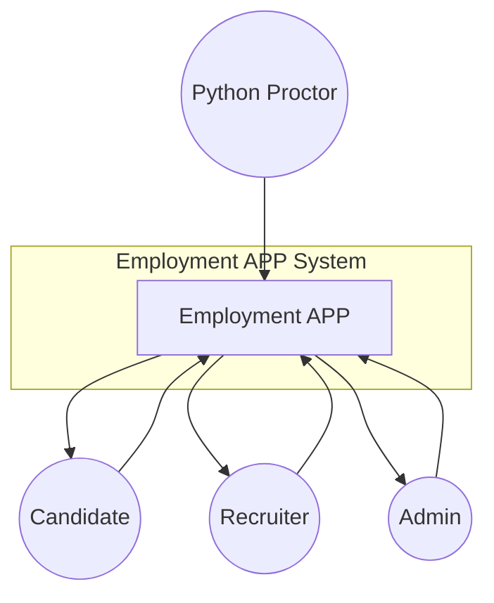
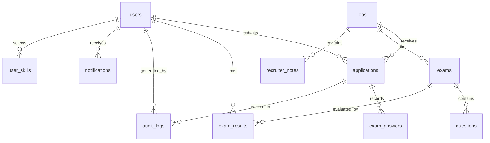

DFD

## Level 0 - Context Diagram



## Level 1 - Major Processes

```mermaid
graph LR
    subgraph Employment_APP
        P1[1. Authentication + 2FA (Login/OTP/TOTP)]
        P2[2. Job Management (Recruiter)]
        P3[3. Application Processing (Candidate Apply)]
        P4[4. Exam Setup + Assignment (Recruiter)]
        P5[5. Proctored Exam Attempt (Candidate + AI + JS)]
        P6[6. Recruiter Review + Reporting (Proctoring Report)]
        P7[7. Admin Analytics + Audit Export]
        P8[8. Candidate Notifications + Interview Confirmation]
    end

    Candidate((Candidate)) --> P1
    Candidate --> P3
    Candidate --> P5
    Candidate --> P8

    Recruiter((Recruiter)) --> P1
    Recruiter --> P2
    Recruiter --> P4
    Recruiter --> P6

    Admin((Admin)) --> P1
    Admin --> P7

    P5 --> PythonProctor : /analyze-frame (AI face check)
```

## Level 2 - Detailed Data Flow (what the code actually reads/writes)

```mermaid
graph LR
    subgraph Data_Stores
        DB[(MySQL Database)]
        Aud[(audit_logs)]
        Apps[(applications)]
        Jobs[(jobs)]
        Exams[(exams)]
        Q[(questions)]
        AAns[(exam_answers)]
        ER[(exam_results)]
        Users[(users)]
        Notes[(recruiter_notes)]
        Notif[(notifications)]
    end

    subgraph Processes
        P1[Auth Controller routes]
        P2[Job + Exam setup routes]
        P3[Candidate submit application]
        P4[Recruiter assign exam]
        P5[Candidate take exam (JS + AI + log-violation)]
        P6[Recruiter review + view report]
        P7[Admin dashboard + audit report PDF]
        P8[Candidate notifications + interview confirmation]
    end

    %% 1) Authentication + 2FA
    Candidate -->|/login-submit| P1
    Recruiter -->|/login-submit| P1
    P1 --> Users : users(email,password,2fa fields)
    P1 -->|redirect| P1 : verify-otp or setup-2fa
    P1 --> Notif : (no direct write)

    %% 2) Candidate application
    Candidate -->|/apply + /submit-application| P3
    P3 --> Apps : INSERT applications(status='Applied', resume_path)
    Apps --> P3 : application_id

    %% 3) Recruiter manages jobs + exams + questions
    Recruiter -->|/post-job,/process-job| P2
    P2 --> Jobs : INSERT/UPDATE/close jobs

    Recruiter -->|/manage-exams,/process-exam,/process-question| P2
    P2 --> Exams : INSERT exams(job_id,title,duration_min,passing_mark)
    P2 --> Q : INSERT questions(exam_id, text, options, correct_answer)

    %% 4) Recruiter assigns exam to application
    Recruiter -->|/assign-exam?app_id=..| P4
    P4 --> Apps : UPDATE status='Exam Assigned'
    P4 --> Aud : INSERT audit_logs action='Status Update'
    P4 --> Notif : (in-app + email) exam assignment notifications

    %% 5) Candidate takes exam (submit_exam.php + log_violation.php)
    Candidate -->|GET /take-exam (render take_exam_form.php)| P5
    P5 --> Exams : getExamByApplication(app_id)
    P5 --> Q : read exam questions

    Candidate -->|JS POST /log-violation (type, application_id)| P5
    P5 --> Aud : INSERT audit_logs action='EXAM_VIOLATION'
    P5 --> DB : INSERT exam_answers, exam_results; UPDATE applications.status

    %% scoring + status update
    Candidate -->|POST /submit-exam| P5
    P5 --> AAns : INSERT exam_answers(application_id, question_id, selected_option, is_correct)
    P5 --> ER : INSERT exam_results(user_id, exam_id, score, status)
    P5 --> Apps : UPDATE applications.status='Exam Completed'

    %% 6) Recruiter review + report
    Recruiter -->|/review-exam?id=app_id| P6
    P6 --> ER : read exam_results
    P6 --> AAns : read exam_answers (selected vs correct)
    P6 --> Aud : read audit_logs for timeline

    Recruiter -->|/view-report?id=app_id| P6
    P6 --> Apps : read application status + ai_score/summary
    P6 --> Notif : (no writes)

    %% 7) Admin analytics + audit PDF
    Admin -->|/admin-dashboard, /generate-audit-report| P7
    P7 --> DB : analytics queries + audit_logs join users/applications/jobs

    %% 8) Candidate notifications + interview confirmation
    Candidate -->|/notifications (GET)| P8
    P8 --> Notif : markAllRead + getForUser

    Candidate -->|/confirm-interview (POST)| P8
    P8 --> Aud : INSERT audit_logs action='Interview Confirmed'
    P8 --> Notif : create notification 'Interview Confirmation'
```

## Data Store Schema (logical view)



## External Entities

| Entity | Description | Inputs | Outputs |
|--------|-------------|--------|---------|
| Candidate | Job seeker | Login, Apply resume, Take exam (answers), Proctor events (tab/blur/camera)| application progress, exam results, notifications |
| Recruiter | Hiring manager | Login, Create jobs/exams/questions, Assign exam, Update status/notes, Review proctoring report | job postings, applicant list, exam review/report |
| Admin | System administrator | Login, view analytics, manage skills/users | dashboard, audit PDF export |
| Python Proctor Service | AI face detector | /analyze-frame(image) | {status: normal|missing|multiple} |

