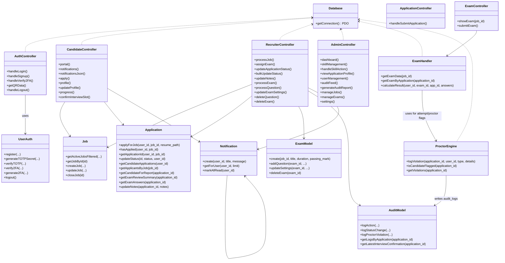
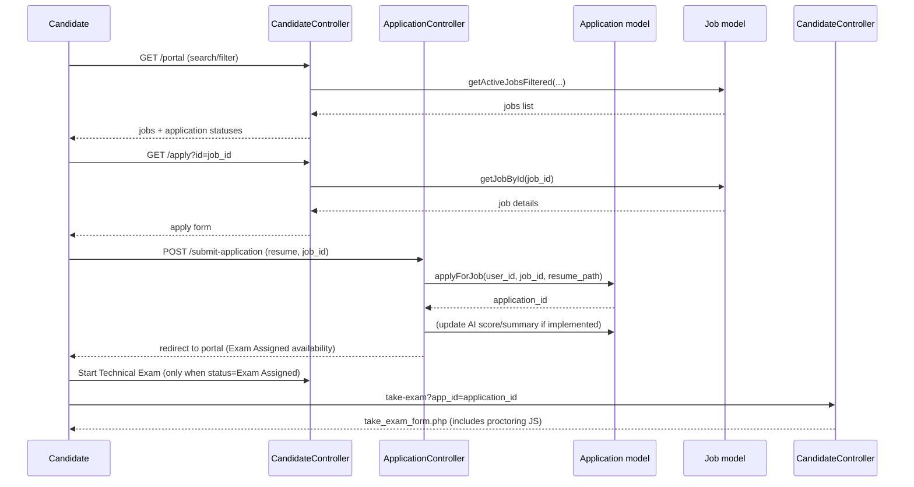
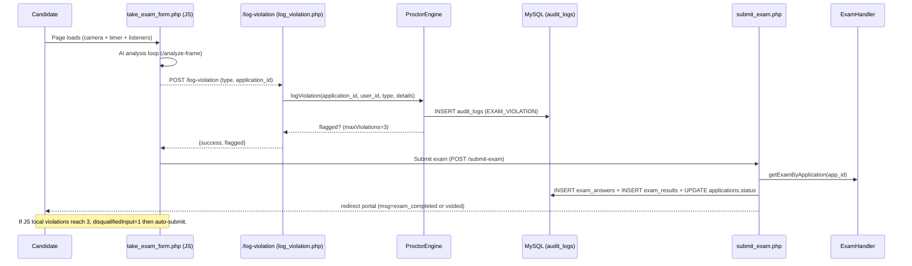
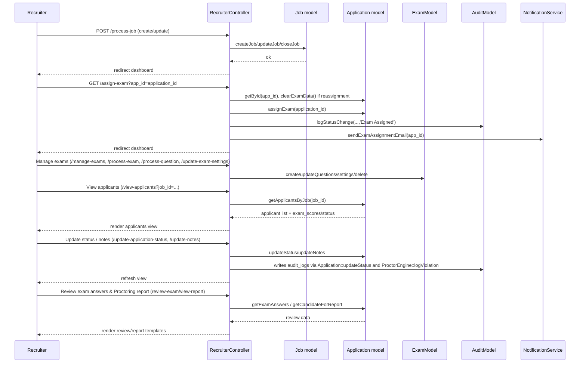

UML

## Class Diagram (current code)

## Sequence Diagram - Candidate: Apply + Start Exam

## Sequence Diagram - Candidate: Proctored Exam Attempt

## Sequence Diagram - Recruiter: Exam Setup + Applicant Review

